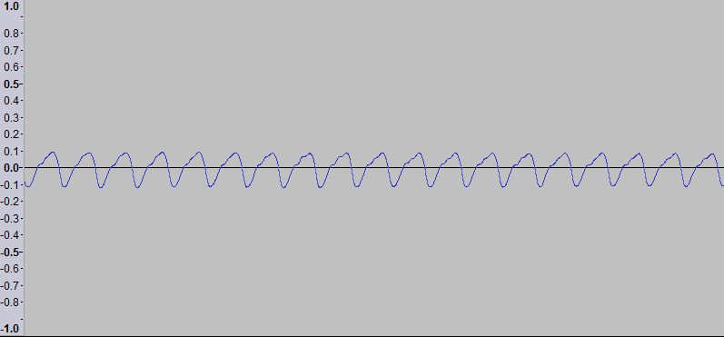
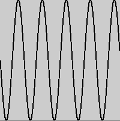

# DT228/DT282 Object Oriented Programming 2018-2019

Resources
---------
- [Install the software you will need for this module](install.md)
* [The Java Tutorial from Oracle](http://docs.oracle.com/javase/tutorial/)
* [Games Fleadh](http://www.gamesfleadh.ie/)
* [The Nature of Code](http://natureofcode.com/)
* [The git manual - read the first three chapters](http://git-scm.com/documentation)
* [A video tutorial all about git/github](https://www.youtube.com/watch?v=p_PGUltnB6w)
* [The Processing language reference](http://processing.org/reference/)

## Contact the lecturer
* Email: bryan.duggan@dit.ie
* Twitter: [@skooter500](http://twitter.com/skooter500)

# Assessments

- [Assignments](assignments.md)

- Week 11 Lab Test 20% 
- Week 12 Assignment Submission - 30%
- End of Year exam - 50%

# Week 5 - Introduction to digital audio
- Sound1 & Sound2 examples
- Take some time to read through this [introduction to digital audio](http://www.jiscdigitalmedia.ac.uk/guide/an-introduction-to-digital-audio) if you are interested in learning more about how digital audio and sound works. It's very interesting.

## Lab 
### Learning Outcomes
- Practice writing loops to iterate over arrays
- Implement the zero-crossings algorithm

Firstly update your forks of the repo to the latest code from this repo.

```
cd OOP-2019-2020
git checkout master
git pull upstream master
git push
```

Handle any merge conflicts you get! If you need help with these ask me or one of the other lab helpers.

Create a branch called for your work today:

```
git checkout -b lab5
```

Today lets implement a simple pitch detection algorithm called Zero Crossings in order to figure out the musical note that is playing. 

If you compile and run the code from the class, you will see the simple audio visualiser we worked on in the class on Monday. This time however, the audio that is being visualised is from a wav file. The wav file is of a tin-whistle playing the scale. To get the wav file to start playing, press a key on the keyboard.

Digital audio, samples the voltage coming from the microphone and stores these voltages as floating point numbers. For CD quality audio, the microphone is sampled 44100 times per second. If you play a note on an instrument like a tin-whistle or a piano and plot the samples on a graph, it would look something like this:



You might notice that this looks a little like a plot of the sin function:



However real instruments generate "harmonics" and so it will never be a perfect sine wave. These are caused by the physical properties of the instrument. That's why the plot of the music not is not a perfect sine wave.

Different musical notes are caused by the the air vibrating at different frequencies. For example, when we hear the note D the wave will repeat 293 times in a second. When we hear the note A, the wave will repeat 440 times in a second. A single "wave" in the audio is called a "period".

One simple way of figuring out the frequency, and hence that note that is playing (for example for automatic transcription of music)  is to count the number of periods that occur in one second. If you notice the waveforms above, you can tell when the period ends, because the signal is *above 0* for one sample and then dips to *0 or below* in the next sample. Think about this and you will understand it makes sense. By counting the number of times this occurs we can tell how many periods there are and hence figure out the frequency of the note that is playing.

Sometimes we dont have a full second of audio, we only have a short section, but we can still use the zero crossings algorithm and just multiply the result. This segment of audio is called a frame of audio. For example, if we only have 1024 samples and we are sampling at 44100Hz, then we have (1024 / 44100) seconds of audio every frame. 

This works out at .023 of a second. If we counted 41 crossings in this frame we would multiply by (1 / .023) to get a frequency of 1765. The frequency of the note A6 is 1760, so we could conclude that the note was an A. This technique won't work all the time because of the harmonics, but its a good first step. If you take the time to understand all of the above you will know something cool and amazing.

Using the Minim library, we can set the size of the frame using this code microphone input:

```Java
in = minim.getLineIn(Minim.MONO, FRAME_SIZE, sampleRate, 16);
```

or this code for a file:

```Java
as = minim.loadSample("scale.wav", 1024);
```

You can get the frame size using:

```Java
in.bufferSize()
```

You can get the actual sample by using:

```
in.left.get(SAMPLE_INDEX);
```
- Write a method in your program ```public int countZeroCrossings()``` that uses the above two methods to count and return the zero crossings. The algorithm is pretty simple, so I'll let you figure it out for yourself.
- When you count the zeros, convert this number to a frequency
- Print out the value using the text command in Processing

When we take a frequency and get the note name for that frequency, this is called "spelling" the frequency. Here is some Java code for the frequencies of the notes in several octaves of the the D Major scale. For musicians in the class, you will know that D Major has 2 sharps. F# and C#, so the frequencies for the notes F and C are those for F# and C#

```Java
float[] frequencies = {293.66f, 329.63f, 369.99f, 392.00f, 440.00f, 493.88f, 554.37f, 587.33f
			, 659.25f, 739.99f, 783.99f, 880.00f, 987.77f, 1108.73f, 1174.66f};
	String[] spellings = {"D,", "E,", "F,", "G,", "A,", "B,", "C", "D", "E", "F", "G", "A", "B","c", "d", "e", "f", "g", "a", "b", "c'", "d'", "e'", "f'", "g'", "a'", "b'", "c''", "d''"};
```
-  Write a class called PitchSpeller that has the above 2 arrays as fields. It should have a method ```public String spell(float frequency)``` that takes a frequency as a parameter and returns the spelling which is *closest* to that frequency. Test your solution by adding code to the main method. For example:

```Java
PitchSpeller ps = new PitchSpeller();
System.out.println(ps.spell(330));
System.out.println(ps.spell(420));
System.out.println(ps.spell(1980));
```

Should print:

```
E,
A,
b
```

You can use the ```Math.abs``` method in your solution to get the absolute value of a number.

Now you can use the PitchSpeller class with your zero crossings algorithm to spell the notes calculated by the zero crossings algorithm you wrote and you will have made a simple transcription system.

Here is a video of what your finished program might look like:

[](https://youtu.be/bfLVzCD2UC0)


# Week 4 - Arrays
- Check out ArraysExample for the program we wrote in the class

## Lab
### Learning Outcomes
- Know to to declare and assign values to an array
- Know how to iterate over an array
- Practice problem solving with arrays

Update your fork to get the ArraysExample we wrote in the class on Monday. Create a new branch for your work today called lab4

### Task 1

Modify the class ArraysExample.java to draw this trend line graph. You should probably add a method to do this and call it from draw()


- You might find the following Processing methods useful:
  - [line](https://processing.org/reference/line_.html)
  - [map](https://processing.org/reference/map_.html)
  - [text](https://processing.org/reference/text_.html) - Prints text to the screen at x and y coordinates
  - [textAlign](https://processing.org/reference/textAlign_.html)

### Task 2

These two arrays give the frequencies of music notes and the corresponding note name in a notation called ABC notation. The names of music notes are called "spellings".

```Java
float[] frequencies = {293.66f, 329.63f, 369.99f, 392.00f, 440.00f, 493.88f, 554.37f, 587.33f
			, 659.25f, 739.99f, 783.99f, 880.00f, 987.77f, 1108.73f, 1174.66f};
String[] spellings = {"D,", "E,", "F,", "G,", "A,", "B,", "C", "D", "E", "F", "G", "A", "B","c", "d", "e", "f", "g", "a", "b", "c'", "d'", "e'", "f'", "g'", "a'", "b'", "c''", "d''"};
```

-  Write a class called PitchSpeller that has the above 2 arrays as fields. It should have a method ```public String spell(float frequency)``` that takes a frequency as a parameter and returns the spelling which is *closest* to that frequency. Test your solution by adding code to the main method. For example:

```Java
PitchSpeller ps = new PitchSpeller();
System.out.println(ps.spell(330));
System.out.println(ps.spell(420));
System.out.println(ps.spell(1980));
```

Should print:

```
E,
A,
b
```

You can use the ```Math.abs``` method in your solution to get the absolute value of a number.


# Week 3 - Using Loops in Java
- [For loop](https://docs.oracle.com/javase/tutorial/java/nutsandbolts/for.html)
- [While loop](https://docs.oracle.com/javase/tutorial/java/nutsandbolts/while.html)
- [Foreach loop](https://docs.oracle.com/javase/8/docs/technotes/guides/language/foreach.html)

## Lab

### Learning Outcomes
- Know how to write a for loop
- Know how to write a while loop
- Know when to use either type of loop
- Practice computational thinking

Update your fork with the latest code from my repo. 

Create a branch for your work today:

```b
cd OOP-2019-2020
git checkout -b lab3
```

You can add your code to the Loops class.

To set colors, you can use the methods:

```
stroke
fill
background
```

These are methods on the PApplet class that take either one parameter (a greyscale value) or three parameters (RGB). Another way of generating colors is by using the HSB colorspace. HSB stands for Hue, Saturation and Brightness. In Processing, these values go between 0-255. Hue is the color, saturation is the amount of grey and brightness is the brightness. It is much easier to generate interesting colors procedurally using HSB colorspace. To use HSB colorspace, call:

```
colorMode(HSB);
```

In the setup method.

Ok here are some patterns you can generate using loops. I suggest you modify the Loops class and add a *seperate method* to generate each of the patterns so you can keep your code modular. Don't forget to call the methods you write from ```draw()```. Also you can call colorMode, stroke and fill in each method you write as appropriate for the problem you are trying to solve.

You could add code so that by pressing the space key, the program advances through these patterns:


These next two require nested loops...


for loops are probably a better choice for most of these, but you should try writing one or two of them using while loops for practice.

# Week 2 - Using Variables in Java, HelloProcessing example

- Check out the HelloProcessing class in the repo
- We drew the all seeing eye using the Processing drawing methods


# Lab 2

## Learning Outcomes
- Practice drawing stuff and working out co-ordinates
- Practice using variables and if statements in Java

This is a video of a silly game called Bugzap made in Java using the Processing libraries. Today we can make a part of this game in order to get some practice using variables in Java.

[](https://www.youtube.com/watch?v=s6PA8jtWneQ)

How you should do it:

Ok let's get the main game working first and not worry about the splash screen and the game over screen

- Update your fork of the repository from the master branch. To do this, cd to the folder where you have cloned your repository, (or clone it somewhere if you need to) and type:

```bash
git checkout master
git pull upstream master
```

- Create a branch for your work today by typing:

```
git checkout -b lab2
```

- Create a new class called BugZap.java in the ie.tudublin folder. Make it extend ```PApplet``` and add the ```settings```, ```setup``` and ```draw``` methods. Check out HelloProcessing.java if you need examples for these.
- Call ```size``` in ```settings``` to set the size of the drawing window. 
- Edit the file Main.java so that it starts the BugZap class instead of the HelloProcessing class. I'll let you figure out how to do this.
- Make sure everything works by compiling and running your program before continuing!

Now we can draw the bug.

- Make fields of type ```float``` in the BugZap class for ```playerX```, ```playerY``` and ```playerWidth``` and give these default values. You can decide what these should be. There are built in variables called ```width``` and ```height``` that give the width and height of the drawing window. These only get assigned after size has been called, so if you want to use these to give values to playerX, playerY etc. put the code into the *setup* method. 
- Write a method called void ```void drawPlayer(float x, float y, float w)``` that draws the player character, centered around the parameters x, y. You can use the line method to do this. You can pass variables as parameters to this method and also things like ```x + 20```, ```w * 0.5f``` etc. I made an extra variable in this method called h for the height and set it to be half the w parameter. Don't forget to set the stroke color!
- Call this method from ```draw```, passing in the parameters playerX, playerY and playerWidth.
- Compile and run everything to make sure it's working before continuing.
- If everything is working ok, you should see the bug on the screen

Now lets get the player moving in response to the keys

Add this method to BugZap.java:

```Java
public void keyPressed()
	{
		if (keyCode == LEFT)
		{
			System.out.println("Left arrow pressed");
		}
		if (keyCode == RIGHT)
		{
			System.out.println("Right arrow pressed");
		}
		if (key == ' ')
		{
			System.out.println("SPACE key pressed");
		}
	}	
```

- If you compile and run the program again you will see that some messages get printed out when you press various keys. If you are running in Visual Studio Code, you will see these messages appear in the Debug Console
- Modify this method to increment and decrement the playerX variable instead and you should be able to get the player to move left and right
- You might want to add if statements to this method to stop the player moving off the left and right side of the screens. If statements in Java are almost the same as in C
- When the player presses SPACE you will want to draw a line for the player's laser.

The Bug

- In a similar way to how you made the player, make the Bug. Make variables and drawBug method. Don't forget to call the method from draw()
- To move the bug you can add a random amount to it's x coordinate on intervals. To generate a random number you can use the [random](https://processing.org/reference/random_.html) function.  
- One way to make stuff happen on an interval rather than every frame is to use the frameCount variable. This variable is a field in PApplet and it gets incremented automatically every time draw is called. Because draw gets called 60 times a second, you can do something every second with this code:

```Java
if ((frameCount % 60) == 0)
{
    // Do something
}
```

- You can print text to the screen using the [text](https://processing.org/reference/text_.html) function.

Ok you should now have the basics working. See if you can figure out how to check to see if the player hits the bug, add scoring, splash screen, game over screen and sound.

# Week 1 - Introduction
## Lab
## Learning outcomes
- Fork the repo, configure the upstream remotes
- Write your first Java code
- Think about doing a project for Games Fleadh!

Firstly fork *this* repository by clicking the fork button above, so that you get your own copy of the repo to work on this semester. Now create a new empty folder on your computer somewhere or on your network drive and then right click on the folder and choose git bash here. Alternatively you can start the bash and cd to the new folder. To clone the repository for your fork:

```bash
git clone https://github.com/YOURGITUSERNAME/OOP-2019-2020
```

Replace YOURGITUSERNAME with your username. Now cd into the repo and check the origin and upstream remotes are set up correctly

```bash
cd OOP-2019-2020
git remote -v
```
You should see something like this:

```bash
origin  https://github.com/YOURGITUSERNAME/OOP-2019-2020 (fetch)
origin  https://github.com/YOURGITUSERNAME/OOP-2019-2020 (push)
upstream  https://github.com/skooter500/OOP-2019-2020 (fetch)
upstream  https://github.com/skooter500/OOP-2019-2020 (push)
```

If you don't see the upstream remote, you can set it up by typing

```bash
git remote add upstream https://github.com/skooter500/OOP-2019-2020
```
You can read more about forking a git repository and setting up the upstream remote in [this article](https://help.github.com/en/github/getting-started-with-github/fork-a-repo)

Once the upstream is setup, you will be able to push code to your own repo and also keep it up to date with the changes I make.

To compile and run the Java code in the src folder, you should type:

```bash
cd java
javac src/ie/tudublin/*.java -d bin
java -cp bin ie.tudublin.Main
```

You should see

```
Hello world!
Misty
Woof!
Meow!
```

On the terminal. If you do, then congratulations! You have successfully compiled and run your first Java program. Now create a branch to store your changes today. Best not to modify the master branch so you can keep it up to date with my changes:

```bash
git checkout -b lab1
```

Use an editor (like Visual Studio code or notepad++) to open up the files in the folder src/ie/tudublin and study them to see if you can figure out whats happening. Modify the code as follows:

- Write a method (functions are called methods in Java) on the Cat class called kill. It should subtract 1 from numLives if numLives is > 0 and print the message "Ouch!". If numLives is 0, you should just print the message "Dead"
- In the Main class in a loop, call kill until the Cat is dead.
- Compile and run your program until you have no bugs and you get the desired output.

Commit and push your changes:

```bash
git add .
git commit -m "killing the cat"
git push --set-upstream origin lab1
```

The "--set-upstream origin lab1" option is only required the first time you commit onto a new branch. After that you can just type "git push"

Check out [this article about last years Games Fleadh projects](https://www.dit.ie/computing/newsevents/eventscompetitions/eventsarticles/headline172312en.html). Have a look at the youtube videos and see what you think!

Check out the [Games Fleadh official website](http://gamesfleadh.ie)

[Download Unity Game Engine](https://unity.com/)

[Check out the Unity tutorials](https://learn.unity.com/) and start making some games!

Check out [this playlist](https://www.youtube.com/watch?v=jw5zXkg84A0&list=PL1n0B6z4e_E79Sl5I9Q7MlJk8tKjhHv_9) and [this playlist](https://www.youtube.com/watch?v=cW8s5i9dmqA&list=PL1n0B6z4e_E6jErrS0ScSCaVrN7KV729x) to get some inspiration if you plan to do the music visualiser assignment

## Lecture
- [Introduction slides](https://drive.google.com/file/d/1wdMcXJzaRBCSm4Ouj4_ZjWj9Mh292fQB/view?usp=sharing)
- [hello world](java/src/ie/tudublin)

Some assignments from previous years:

[](https://www.youtube.com/watch?v=ENDHavHsL2k)

[](https://www.youtube.com/watch?v=zLXon_nlibY)

[](https://www.youtube.com/watch?v=vecMCz1eB1s)

[](https://www.youtube.com/watch?v=xlEudfLH6Fg)

[](https://www.youtube.com/watch?v=uykz5mCjV0w)

[](https://www.youtube.com/watch?v=sPjZSRCmt1U)